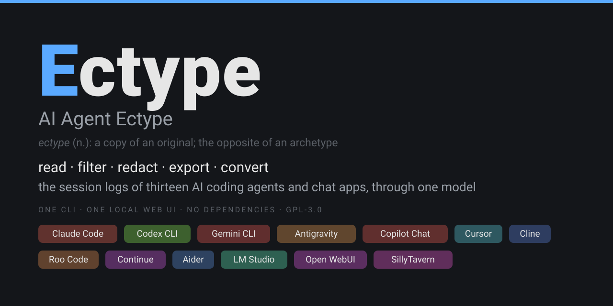
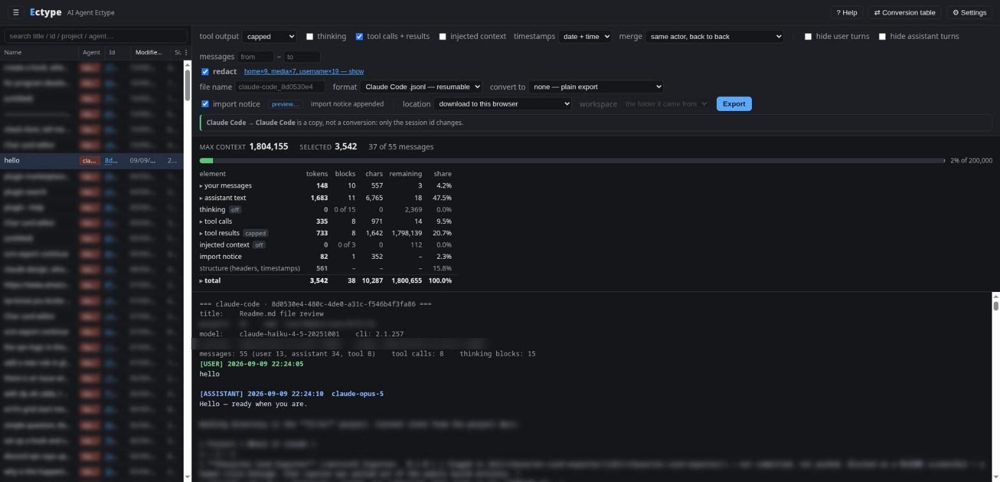
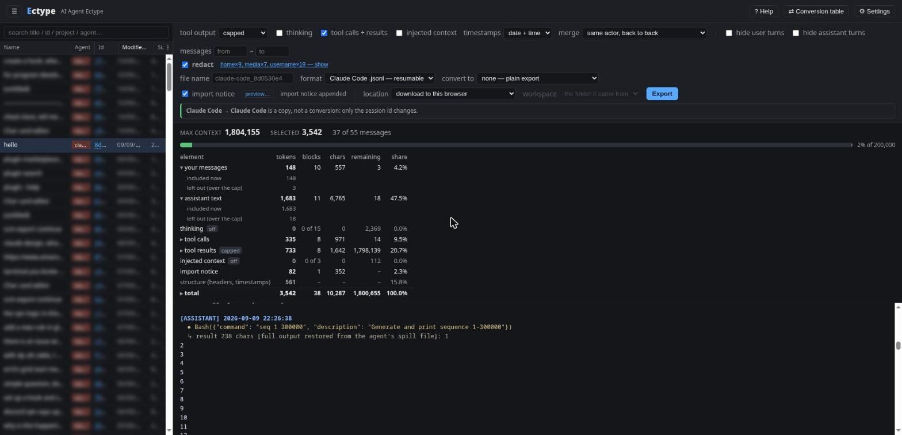
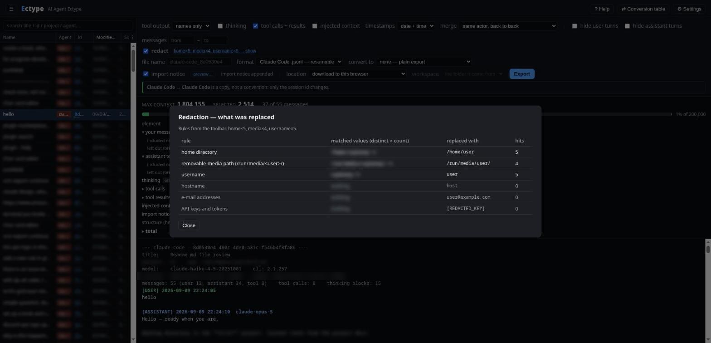
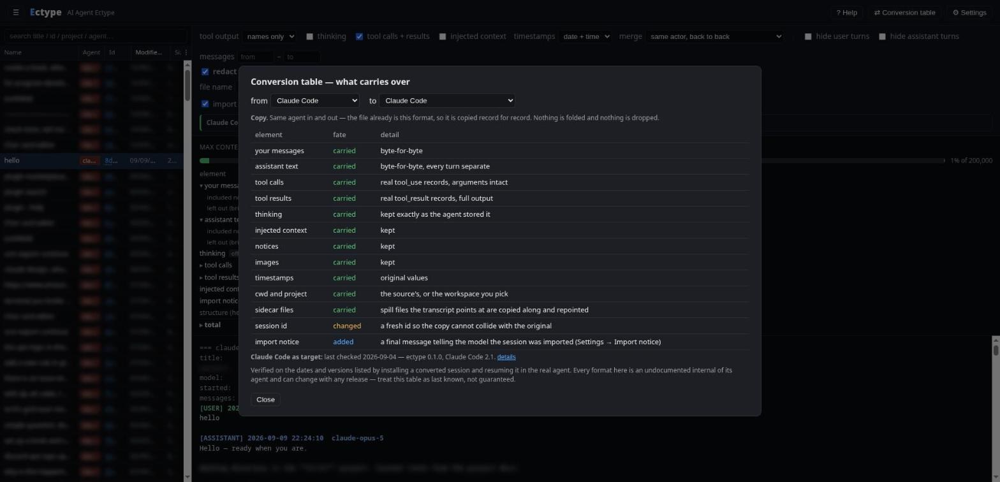
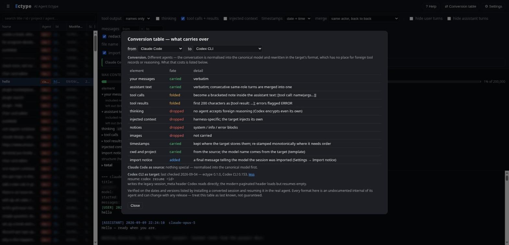
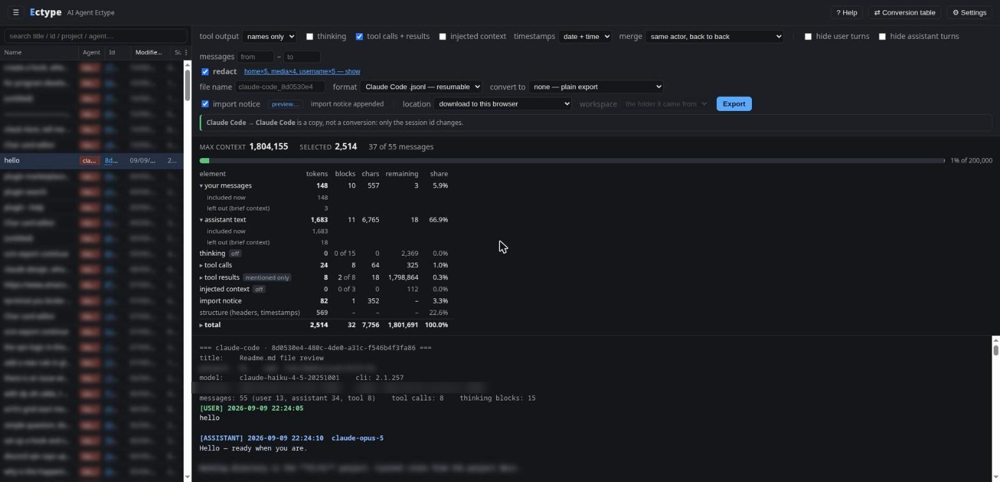
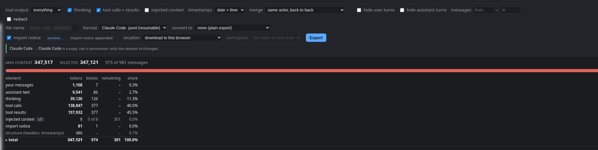
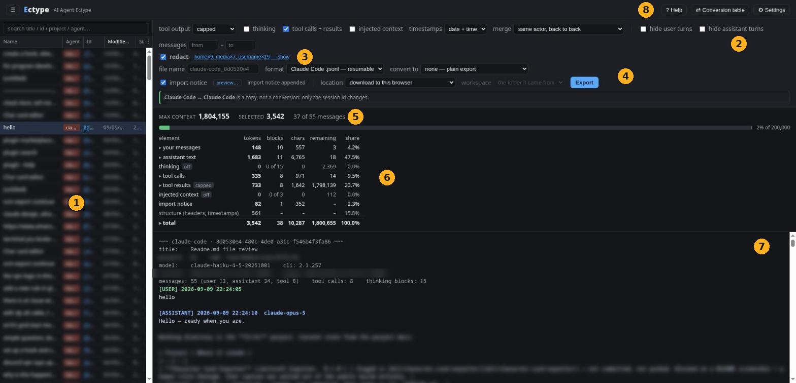

# AI Agent Ectype (`ectype`)



Thirteen AI agents, thirteen undocumented session formats, and not one of them hands the
conversation back to you. `ectype` reads all of them through a single reader, so a finished
session can be picked up again: **copied back into the agent and resumed with its context
intact**, handed to a different agent, or cut down to the parts that still matter and pasted
wherever you need them.

Carrying the context forward is the point. The export formats, the redaction and the token budget
exist to make that affordable: the 981-message session below is 347,517 tokens whole and 13,073
with tool output reduced to names, and you can see the difference before you spend it.



## Install

```bash
pipx install ectype-cli                             # or: pip install ectype-cli
uv tool install ectype-cli                          # the same, through uv
pip install "ectype-cli[tokens]"                    # plus tiktoken, for exact token counts
pip install git+https://github.com/chaybits/ectype  # the tip of main instead of a release
ectype agents                                       # which stores exist on this machine
```

Python 3.10+ and no dependencies. The distribution is `ectype-cli`; the command and the import
package are both `ectype`. Without the `tokens` extra, token counts are estimated at four
characters each.

Every release also carries **`ectype.pyz`**, the whole program as a single file. A `.pyz` is
an ordinary zip archive with an entry point inside it, and Python runs one directly, so
`python ectype.pyz gui` is all of it: Linux, macOS and Windows alike (`py ectype.pyz gui` there).
On Unix the file is also marked executable, so `./ectype.pyz gui` works after a `chmod +x`. It
carries the program, not the interpreter, so Python 3.10+ still has to be installed. This is
possible only because there are no dependencies to install beside it.

Each agent's store is resolved in one order: **`$ECTYPE_<AGENT>_HOME`** (Codex uses its own
`$CODEX_HOME`), then the path saved in Settings, then the agent's own default. `ectype agents`
prints the variable, the resolved path and which of the three won, one row per agent. The
environment variable stays on top so a one-off run against a fixture never depends on the saved
file.

Settings also decide which agents the web UI lists: coding agents are on by default, chat apps
(LM Studio, Open WebUI, SillyTavern) are opt-in.

## Why

Ten coding agents and three chat apps, each keeping its history in a different, undocumented
shape:

| Agent | Store | Shape |
|---|---|---|
| Claude Code | `~/.claude/projects/<slug>/<uuid>.jsonl` | append-only message log; tool results ride inside the next `user` record; a result too big to inline is replaced by a stub and spilled to `<uuid>/tool-results/<hash>.txt` |
| Codex CLI | `$CODEX_HOME/sessions/YYYY/MM/DD/rollout-*.jsonl` | append-only event log; reasoning **encrypted**; full tool output in `item_completed` events, model-visible copy truncated |
| Gemini CLI | `~/.gemini/tmp/<project>/chats/session-*.jsonl` | **mutation log**: `$set` snapshots + re-emitted messages; last record per id wins; big outputs spill to `tool-outputs/` |
| Antigravity | `~/.gemini/antigravity-cli/brain/<id>/…/transcript_full.jsonl` | step log; tool results as separate steps or `steps/N/output.txt`; a **failed** call leaves no step at all; a working directory is recorded only for conversations opened in a workspace |
| VS Code Copilot Chat | `Code/User/**/chatSessions/*.jsonl` | **JSON-path patch log**: `kind 0` base, `kind 1` set-at-path, `kind 2` append; state must be replayed |
| Cursor | `Cursor/User/globalStorage/state.vscdb` | **SQLite** (WAL): `composerHeaders` index + `cursorDiskKV` rows `composerData:` / `bubbleId:`; one bubble per thinking block, tool call or text segment |
| Cline | `~/.cline/data/sessions/<id>/` | metadata json + `.messages.json` with Anthropic-shaped blocks |
| Roo Code | `globalStorage/…roo-cline/tasks/<id>/` | **three files**: `api_conversation_history.json` (conversation), `ui_messages.json` (timestamps, errors), `history_item.json` (metadata) |
| Continue | `~/.continue/sessions/<id>.json` | `history[]`; `toolCallStates` holds the call **and** its result in one object |
| Aider | `.aider.chat.history.md` per repo | **Markdown**: `#### ` = user, `> ` = console, plain = assistant; one file, many runs |
| LM Studio | `~/.lmstudio/conversations/<epoch>.conversation.json` | `versions[]` + `currentlySelected` (**branching**); assistant = `steps[]`; the tool's **output is never stored** |
| Open WebUI | `<DATA_DIR>/webui.db` → table `chat` | **SQLite** row with the frontend's chat JSON: `history.messages` is a **tree** (regenerations are siblings), `messages[]` the current branch |
| SillyTavern | `<data>/<user>/chats/<Character>/<name>.jsonl` | header line + one message per line; `swipes[]` keep every regenerated alternative (**branching**) |

### Sidecar files

When a tool result is too large for the transcript, some agents write the full text to a file
beside it and leave a short preview in its place. `ectype` follows the pointer and puts the full
text back into the render, and a native copy carries those files along and repoints them.

| File | What it is | What `ectype` does |
|---|---|---|
| Claude `<uuid>/tool-results/<hash>.txt` | the full text of a result the transcript truncated | read back into the result block; copied with a native export |
| Claude `<uuid>/subagents/agent-*.jsonl` | Task-tool subagent runs, separate conversations | listed in `session.meta["subagents"]`, never folded into the parent |
| Claude `<uuid>/custom-title.json` | the title you set by hand, written only when you set one | used as the session title; otherwise the transcript's own summary or first prompt is used |
| Gemini `tool-outputs/session-<id>/<callId>.txt` | the same idea, per tool call | recorded as `spill_path` on the result |
| Codex `session_index.jsonl` | store-level thread index | read for titles; written when installing a session |



## Use

### Find a session

```bash
ectype list                  # newest sessions across every agent
ectype list -a codex -n 5    # one agent, five rows
```

Every other command takes an id, and any unambiguous prefix of one will do. If the same id exists
under two project folders (a session resumed from another directory), `--project <part of the
path>` picks one.

### Read one

```bash
ectype show a1b2c3d4                            # the default view
ectype show a1b2c3d4 --thinking --cap 0 -o session.txt
ectype show a1b2c3d4 --no-tools                 # conversation only
```

The default view keeps the conversation, every tool call, and the first 150 tokens of each tool
result; thinking is off. `--cap N` moves that limit (`--cap 0` cuts nothing), `--thinking` adds
the reasoning, `--no-tools` drops tool activity altogether. Without `-o` it prints to stdout.

### Know what happened in it

```bash
ectype summarize a1b2c3d4        # asks, tools, files, commands, errors, keywords
```

Extracted from the transcript, with no model and no API key: what was asked, which tools ran and
how often, which files were touched, which commands ran, what failed, and a lowercase keyword line
meant for `grep` rather than for reading. On a 981-message session that is a few hundred tokens
against 347,517 for the transcript, which is often enough to decide whether to open it at all.

### Export it

```bash
ectype export a1b2c3d4 --mode brief -o gist.txt                    # tool call names only
ectype export a1b2c3d4 --format markdown --cap 300 -o notes.md     # text · markdown · html · json · jsonl · csv
ectype export a1b2c3d4 --redact --no-tools -o share.txt            # safe to paste somewhere public
ectype export a1b2c3d4 --wrap user --format jsonl -o one.jsonl     # the whole transcript as ONE message
```

`--mode` is the one dial that decides most of the bill: `brief` keeps the tool's name alone,
`custom` keeps the first `--cap` tokens of each result, `full` keeps every argument and every
byte. Back-to-back turns of the same actor are merged into one turn by default, a tool result
riding with the call that produced it (`--no-collapse` turns that off).

Every export starts with a header naming the session, its project, model and message counts.
Where the view leaves something out, the transcript says so at that point: a capped result carries
`…[+n tokens cut]`, a names-only call prints no output, and the web UI shows "685 of 924 messages"
beside the budget. `--notice` appends a final message telling the receiving model that the session
was imported and that paths, dates and tools should be re-checked.

`--redact` applies rules computed from the running machine, so nothing personal is hard-coded:
your home directory, your username, hostname, e-mail addresses, common API-key shapes, optionally
IP addresses, and optionally the timezone offset. Every run reports what matched
(`home×6, media×62, email×1`), and the web UI shows each matched value next to its replacement, so
a false positive is visible rather than silent. Add your own with `--redact-term TEXT` or
`--redact-term TEXT=REPLACEMENT`.



### Continue it somewhere

```bash
ectype convert e5f6a7b8                                   # a copy of the session, same agent
ectype convert e5f6a7b8 --install --workspace ~/code/proj # into the agent's store, ready to resume
ectype convert b2c3d4e5 --to codex --install              # then: codex resume <id>
```

**Same agent in, same agent out is a copy, and nothing is lost.** The file already is that format,
so `ectype` rewrites it record for record: tool calls, tool results, thinking, images and injected
context all survive, sidecar files travel with it, and the only things that change are the session
id (so the copy cannot collide with the original) and the working directory if you re-home it with
`--workspace`. That is what makes "carry on from here" possible.

**A different agent is a real conversion, and it costs something.** No agent has a place for
another's tool records or reasoning, so your messages and the assistant's text carry over verbatim,
tool activity folds into short bracketed notes inside the assistant text, and thinking and injected
context are dropped. Every conversion writes a `*.fidelity.md` counting what was kept, folded and
dropped, and the web UI shows the same table before you commit to it.





Claude Code, Codex CLI and Gemini CLI can be written, because each was proven by installing a
converted session and resuming it for real (2026-09-04, against Claude Code 2.1, Gemini CLI 0.58
and Codex CLI 0.153). The other ten are read-only: Antigravity and Cursor keep resumable state in
a database an outside writer cannot safely forge, Copilot Chat in a patch log the editor holds
open, Aider has one shared Markdown history per repo with no session to resume, the chat apps have
no resume at all, and Cline, Roo Code and Continue are plausible targets that no live resume has
been proven for yet. They still appear in the menu, greyed out and labelled.

For a cross-agent conversion, `--template <a real session file of the target>` copies that agent's
own envelope (version, cwd, flags), so the output is valid for the release you actually run.

Two flags spend a small API call to replace a guess with a fact, so neither is ever the default.
`--mint-template` runs the target once on its cheapest model and uses the session it writes as the
template, so the envelope matches the release you actually have installed. `--verify`, after an
`--install`, resumes the installed session in the target agent and reports whether it answered.

### Keep a copy

```bash
ectype backup a1b2c3d4                  # the transcript and every sidecar file it owns
ectype backup --list                    # what has been saved, newest first
ectype backup --restore NAME --dry-run  # names every destination, writes nothing
```

Each backup is one timestamped folder with a manifest recording where every file came from, which
is what lets `--restore` put them back without guessing. An install takes one of these by itself
whenever it would modify a file the store already owns, and `--no-backup` opts out. Most installs
only add a file and so need nothing: Codex is the exception, because it appends to the store's own
session index and its migration rewrites the thread history.

### Browse it

```bash
ectype gui        # 127.0.0.1:8765, stdlib http.server, no dependencies
```

### Let the agent read it

```bash
claude mcp add ectype -- ectype mcp     # any MCP client: ectype mcp speaks JSON-RPC on stdio
```

Four read-only tools: `list_sessions`, `session_budget` (what a session costs before you read it),
`show_session` (at a depth the agent picks) and `list_agents`. So an agent can answer "what did we
decide about X last week" by finding the session, checking the price, and pulling in the names-only
view instead of 347,517 tokens of transcript.

A fifth tool writes into an agent's store and therefore does not exist unless you start the server
with `ectype mcp --allow-write`: a tool an agent cannot see is a tool it cannot be talked into
calling. There is a Claude Code slash command too. See [`integrations/`](integrations/).

## What a session costs

One real session: 981 messages, 8 MB of JSONL on disk, 377 tool calls, counted with `cl100k_base`.

**What fills it**, with every option on and nothing capped, 347,517 tokens:

| element | tokens | share |
|---|---|---|
| tool results | 157,932 | 45.4% |
| tool call arguments | 138,847 | 40.0% |
| thinking | 39,126 | 11.3% |
| assistant text | 9,541 | 2.7% |
| your messages | 1,108 | 0.3% |
| injected context | 301 | 0.1% |
| headers and timestamps | 662 | 0.2% |

The conversation itself is 3% of that. Everything else is the agent talking to its tools, which is
why one dial decides almost the whole bill.

**What each setting of that dial costs**, on the same session, thinking off:

| view | tokens | against the default |
|---|---|---|
| everything, nothing capped | 307,897 | +239,048 |
| results capped at 150 (the default) | 68,849 | 0 |
| results capped at 50 | 56,656 | -12,193 |
| names only | 13,073 | -55,776 |
| no tool calls or results at all | 11,034 | -57,815 |

Names only keeps every call, in order, with its name and nothing else, and costs 4% of the whole
session. It drops the arguments too, which is most of the saving: a single `Bash` command or file
patch runs to hundreds of characters, and 377 of them are 138,847 tokens before a byte of output
is counted.



And the same session with everything switched on and nothing capped, which is where the first
table comes from:



## Web UI



1. **The session list.** Every session of every enabled agent, as a file manager shows files: sort
   by any column, drag the edges to resize, `⋮` chooses which columns appear, and the search box
   filters by title, id, project or agent. Clicking an id copies it. **Double-click a name to
   rename it**, which for Claude Code writes the same `custom-title.json` the agent writes itself,
   so the new name shows up there too; for a store with no place for a name, ectype keeps it on
   its own side rather than inventing a field in someone else's database. An empty name restores
   the generated one. <kbd>Ctrl</kbd>+<kbd>B</kbd> hides the whole panel. The size column is the
   file on disk, which also holds the JSON envelope and usage records, so it is several times the
   transcript inside it.
2. **What goes in.** Tool output (names only, capped, everything), thinking, tool calls and
   results, injected context, timestamps, merge, hiding either side, and a message range. Every
   control has a tooltip, and **? Help** explains all of them and every number.
3. **Redaction.** Switch it on and its rules appear inline, with a box for your own words. After a
   render the status line lists what matched; clicking it shows every matched value next to its
   replacement.
4. **Export.** The format menu starts with this agent's own resumable format, then text, markdown,
   html, json, jsonl and csv. **convert to** lists every agent, source-only ones greyed out, and
   says what that conversion costs. **location** is a download, a folder on this machine, or the
   agent's own store, ready to resume; **workspace** picks the directory the copy is filed under.
5. **Two numbers.** *max context* is the whole session with everything on and nothing capped, and
   does not move while you toggle. *selected* is exactly what the preview shows, which is what the
   export will cost. The bar measures selected against a reference size you set (the context
   window you are pasting into), and the dashed mark is where max context would land.
6. **Where they go.** One row per element, with a total row that equals *selected* exactly. A
   partly included element expands into what is in now and what is left out.
7. **The preview.** Exactly what the export will contain, coloured by role.
8. **Help, the conversion table for any pair of agents, and Settings**: which agents are listed,
   each agent's store path and resume format, view defaults, redaction rules, export behaviour and
   the wording of the import notice.

Times are printed in local time; every store records UTC internally.

## Known limitations

- **Cross-agent conversion is messages-only.** Tool activity folds into bracketed text and
  thinking is dropped, even where the target could represent them natively.
- **Branching stores are flattened.** SillyTavern swipes, LM Studio versions and the Open WebUI
  message tree load as the selected path; the alternatives are parked in `meta["alternatives"]`.
- **Three writable targets.** Only Claude Code, Codex CLI and Gemini CLI can be written, because
  each was proven by installing a converted session and resuming it for real.
- **A headless Antigravity run's working directory** lives only in `cli.log`, which is short and
  rotates; older headless runs have none.
- **Codex full outputs are matched to calls by order**, not by id: usually right, not always.
- The formats parsed here are undocumented internals of each agent and can change with any
  release. Every adapter records the layout it was written against.

## Disclaimer

`ectype` reads, and on request writes, the private files of other programs, whose formats are
undocumented and can change with any release of those programs.

- **It takes a copy before it disturbs anything.** `ectype backup <id>` saves a session and every
  sidecar file that belongs to it, `--list` shows what has been saved, and `--restore NAME` puts
  it back (`--dry-run` first, which names every destination and writes nothing). An install that
  would modify a file the store already owns takes that copy by itself, unless you pass
  `--no-backup`.
- **Redaction is best effort, not a guarantee.** It replaces what its rules match, and no set of
  rules can know every secret a transcript happens to contain. Read an export before you share it;
  that is what the list of matched values is for.
- **`--install` and the "put it in the agent's store" location write into a live agent's store.**
  Close the agent first.
- **A conversion is not a restoration.** A converted session gives another agent the conversation,
  not the state the original ran with: paths, files, versions and tools may all differ. The import
  notice exists to say so to the model that receives it.

## License

GPL-3.0-or-later (see `LICENSE`).
